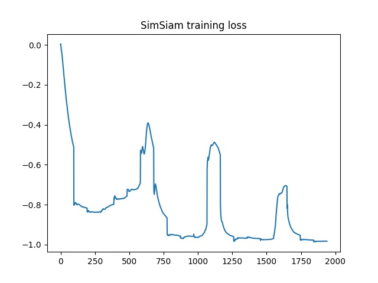
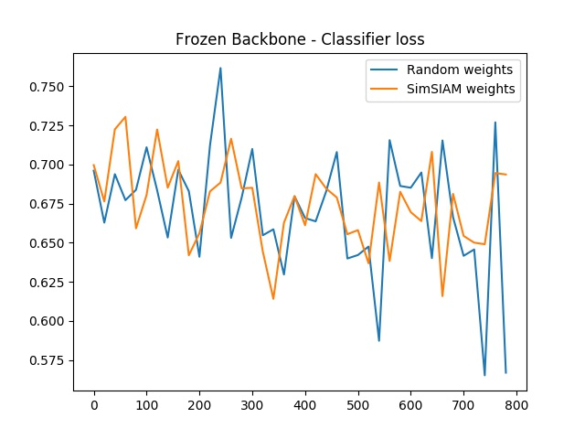

# SimSIAM (Exploring Simple Siamese Representation Learning) - PyTorch

This repository shows a simple implementation of [BYOL (Bootstrap Your Own Latent)](https://arxiv.org/abs/2006.07733) technique to perform self-supervised learning.

To show the functionality I used the [Cats and Dogs dataset](https://www.microsoft.com/en-us/download/confirmation.aspx?id=54765) which is full labeled, but to simulate a scenario where we would apply self-supervised learning, I took 250 images as labeled and all other samples (24750 samples) unlabeled. 

To fit in a 8GB GPU and run in a feasible time I used the following:
- Resnet18 (starting from random weights, not the pretrained) 
- Resize to (150x150)
- Batch size of 256. 
This configuration take ~ 50 sec per epoch.

## Pipeline
1. Train the self-supervised model using the code [train.py](train.py). At end it will be generated a saved named siam.pt

2. Train a [simple classifier](classifier.py) using the same Resnet18 (starting from random weights, not the pretrained), add a classifier head at top of Resnet18, and use the 250 labeled data. 

3. Train a simple classifier using the encoder of the model siam.pt, add a classifier head at top of model, and use the 250 labeled data.

4. Plot the loss results

# Results
### SimSIAM training loss
As it can be seen at graph, I'm havings some troubles, as the model is getting in the collapse direction. 

To validate this, see the classifier loss using the pre-trained model vs. the random model. This shows the training loss of the frozen backbone and training only the classification head. Here we can saw clearly that the backbone features from "Random weights" model performs better compared with the features generate by the “SimSIAM weights” pre-trained in self-supervised.

# Thoughts
- Maybe, to avoid the collapse, this strategy only works on huge datasets? 
- BYOL (two networks and EMA) works fine in the same dataset. See this [repository](https://github.com/renatoviolin/self-supervised-learning-BYOL)

# References
- [Exploring Simple Siamese Representation Learning](https://arxiv.org/pdf/2011.10566.pdf)
